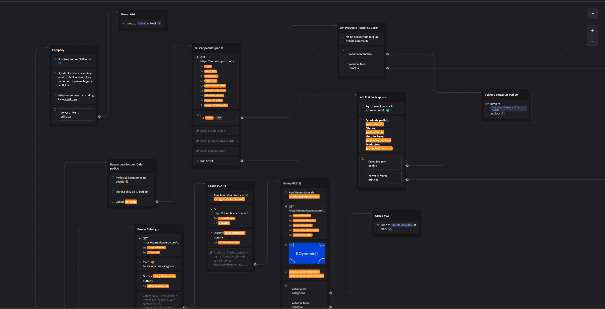

# Introducción

El flujo de Chatbot fue creado para la gestión de la comunicación entre el CRM y el cliente. El Chatbot fue creado para la gestión de las necesidades de los usuarios. El Chatbot fue pensado para que los clientes puedan interactuar con la empresa de una forma rápida y sencilla.

## Vista rápida de creación de Flujo

## Vista rápida de flujo conversacional

