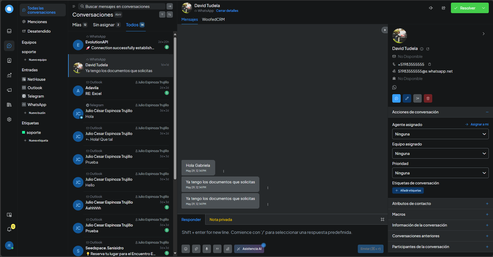

# Introducción

Para el desarrollo y alcance de NetHouse, se realizó el despliegue de un CRM en entorno de pruebas para evaluar la comunicación directa y centralizada con los clientes de la empresa. El CRM fue pensado para que la empresa pueda interactuar con sus clientes de una forma más eficiente y eficaz, con multiples agentes en un solo lugar.

## Vista rápida de CRM

